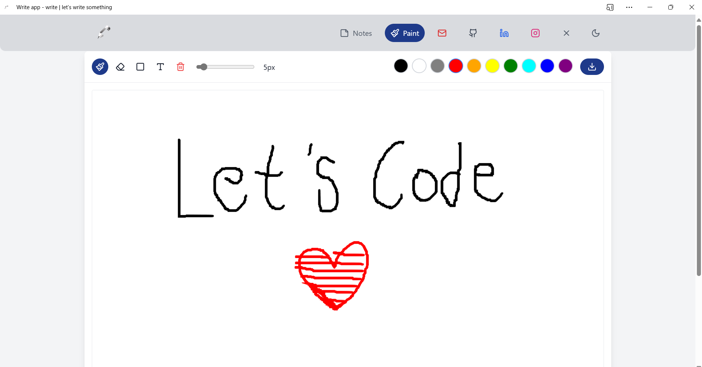
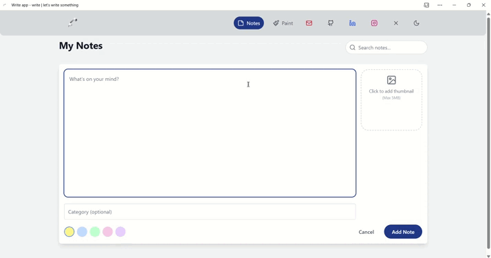
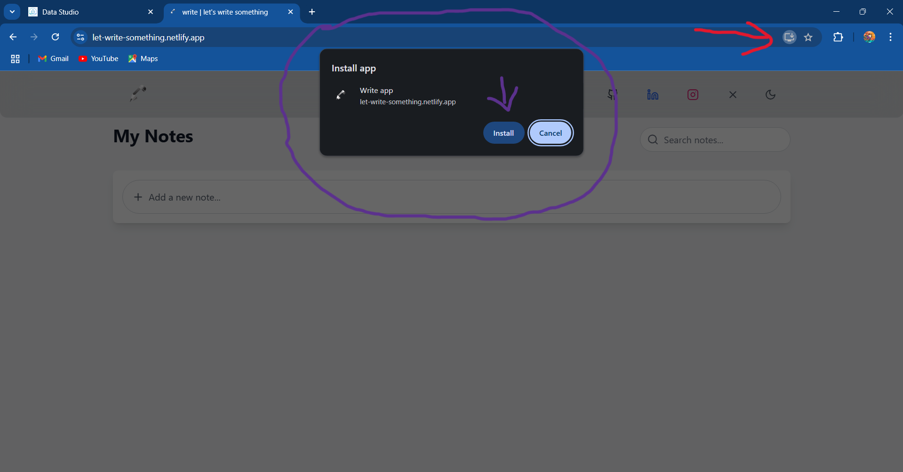
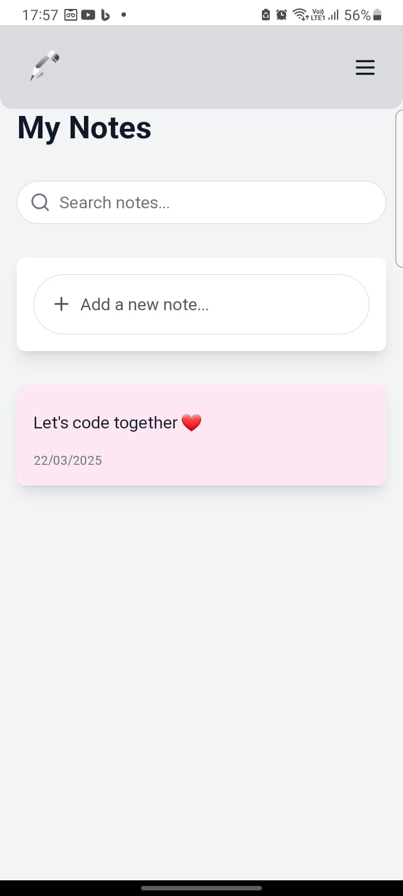

# Write App ( Built with AI )

[](https://github.com/CoderRony955/write-app/blob/main/LICENSE)

<p align="center">
  
</p>

## 📝 Sticky Notes & Paint 🎨 – A Feature-Rich Productivity PWA

This React-based app combines the power of sticky notes and a paint tool, making it perfect for quick note-taking and sketching. Plus, it’s a Progressive Web App (PWA), meaning users can install it directly from the browser on any platform (Windows, macOS, Linux, Android, iOS) for an app-like experience!

## Features  
-  *Sticky Notes* – Create, edit, and delete notes effortlessly
  
- *Paint Tool* – Draw and express your ideas freely
  
- *Quick Shortcuts* – Direct links to Email, LinkedIn, and GitHub for instant access
  
- [*PWA Support*](https://web.dev/learn/pwa/progressive-web-apps/) – Install the app on any device from the browser
  
- *User-Friendly Interface* – Clean, minimal, and intuitive design


## Overview
- Paint Tool
<p align="center">
  
</p>

- Sticky Notes
<p align="center">
  
</p>

- PWA Support
<p align="center">
  
</p>

- Mobile View

<p align="center">
  
</p>


## Technologies Used

- [React](https://react.dev/)
- [Vite](https://vite.dev/)
- [Tailwind CSS](https://tailwindcss.com/)


## How to use?

### For normal users:
  1. Open the app in your browser via the link: [Write App](https://let-write-something.netlify.app/)
 
 2. For PWA users:
  - Open the app in your browser via the link: [Write App](https://let-write-something.netlify.app/)
  - Install the app from the browser menu
  <p align="center">
    
  </p>

  - Use the app as you would any other app
  
  <p align="center">
    
  </p>

### For developers:

1. Clone this repository:
```sh
git clone https://github.com/CoderRony955/write-app.git
```

2. change the directory:
```sh
cd write
```

3. Install dependencies:
```sh
npm install
```

4. Start the app:
```sh
npm run dev
```


## Contributing  

We welcome contributions from the community! Whether it's fixing a bug, improving documentation, or adding a new feature, your help is appreciated.  

### Steps to Contribute  

1. **Fork the Repository**: Click the `Fork` button on the top right of this page.
2. **Clone Your Fork**:  
   ```sh
   git clone https://github.com/CoderRony955/write-app.git

   cd write
   ```
3. Create a New Branch:
```sh
git checkout -b feature-branch
```
4. Make Your Changes: Implement your improvements or fixes.
5. Commit Your Changes:
```sh
git add .
git commit -m "Added a new feature"
```
6. Push to Your Fork:
```sh
git push origin feature-branch
```

7. Create a Pull Request:
- Go to the original repository.
- Click on `Pull Requests` > `New Pull Request`.
- Select your fork and branch, then submit the PR.


## My Socials

<a href="https://www.instagram.com/__raunakk__/" target="_blank">
    
  </a>
<a href="https://discord.gg/SK9k6mdzvP" target="_blank">
    
  </a>
